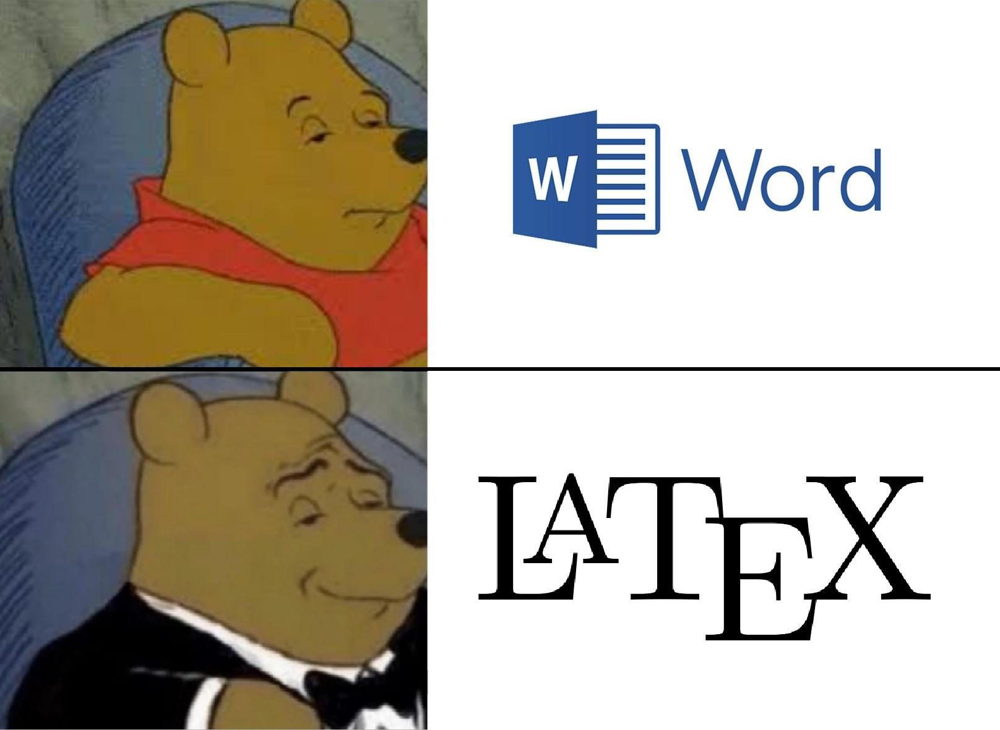

Về mặt hình thức soạn thảo văn bản trên máy tính, chúng ta vẫn thường quen thuộc và hay nhắc nhau về việc nắm vững những quy tắc, kĩ năng, thực hành thành thạo bộ công cụ cơ bản, quen thuộc như Microsoft Office, WPS Office hay sử dụng những công cụ soạn thảo trực tuyến như Word Online, Google Docs.

Dần về sau, nếu ta đã thành thục được những công cụ cơ bản soạn thảo trên, tiếp tục học tập và làm việc ở môi trường học thuật cao hơn nhằm để viết luận văn, viết sách, viết báo gửi đến các tòa soạn, tạp chí lớn đến nhỏ, trong nước đến quốc tế hay cũng có thể dùng để làm slides thuyết trình cần tính tiện ích và mỹ thuật đơn giản, cơ bản. Thì LaTex chính là công cụ được mọi người trong và ngoài giới học thuật tin tưởng, ưa chuộng, chọn để sử dụng.

## Định nghĩa

LaTex (phát âm là “Lay-tech” hay “Lah-tech”) là một gói các tập lệnh cho phép tác giả có thể soạn thảo và in ấn tài liệu của mình với chất lượng bản in cao nhất thông qua việc sử dụng các kiểu trình bày chuyên nghiệp đã được định nghĩa trước.

LaTex được thiết kế bởi Leslie Lamport, sử dụng bộ máy định dạng TeX (được xem là tiền thân của LaTex) để làm hạt nhân cơ bản phục vụ cho việc định dạng tài liệu.

TeX, bộ máy định dạng của LaTex, sử dụng các Metafont có chất lượng rất tốt (Computer Modern), được tạo bởi Donald E.Knuth, phát hành vào năm 1982 cùng với một số nâng cấp được bổ sung vào năm 1989 để hỗ trợ tốt hơn cho các kí tự 8 - bit và đa ngôn ngữ. TEX đã được cải tiến và trở nên cực kỳ ổn định, có thể chạy trên các hệ thống máy tính khác nhau và gần như là không có lỗi. Các phiên bản của TEX đang dần tiến đến số π và phiên bản hiện nay là 3.141592.

## Sự khác nhau cơ bản giữa Word và Latex

Không giống những trình soạn thảo văn bản thông dụng như Microsoft Word hay LibreOffice Writer, LaTeX không phải là một trình soạn thảo WYSIWYG (‘What You See Is What You Get’). Trong LaTeX, ta dùng văn bản thuần túy (plain text) và thêm các markup (dưới dạng các câu lệnh, ...vv...) vào.

Những markup này sẽ cho LaTeX biết ý nghĩa của từng phần trong văn bản, tương tự như HTML.

Ví dụ, thẻ đóng và mở `
` bắt đầu một phần trong một văn bản HTML. LaTeX cũng có một câu lệnh cho việc này, đó là \section.

Nói tóm lại, Word thì gõ chữ cái và sử dụng công cụ đồ hoạ để thực hiện việc định dạng văn bản, còn LaTex là "lập trình" ra văn bản.

## Ưu và nhược của Latex

Khi những người sử dụng các phầm mềm WYSIWYG và những người sử dụng LaTeX gặp nhau, họ thường tranh luận về những điểm mạnh và điểm yếu của LaTeX đối với các chương trình soạn thảo thông thường” và ngược lại. Cách tốt nhất mà ta nên làm là đứng giữa và lắng nghe. Tuy nhiên, đôi lúc ta sẽ không thể nào đứng ngoài được!

Dưới đây là một số điểm mạnh của LaTeX:

- Các mô hình trình bày bản in chuyên nghiệp đã có sẵn và điều này sẽ giúp cho tài liệu do bạn soạn thảo trông thật chuyên nghiệp.

- Việc soạn thảo các công thức toán học, kỹ thuật được hỗ trợ đến tối đa.

- Người sử dụng chỉ cần học một số lệnh dễ nhớ để xác định cấu trúc logic của tài liệu. Người dùng gần như không bao giờ cần phải suy nghĩ nhiều đến việc trình bày bản in vì công cụ sắp chữ TeX đã làm việc này một cách tự động.

- Ngay cả những cấu trúc phức tạp như chú thích, tham chiếu, biểu bảng, mục lục, . . . cũng được tạo một cách dễ dàng.

- Mọi người có thể sử dụng rất nhiều gói thêm vào (add-on package) miễn phí nhằm bổ sung những tính năng mà LaTeX không hỗ trợ một cách trực tiếp. Ví dụ: các gói thêm vào có thể hỗ trợ việc đưa hình ảnh PostScript hay hỗ trợ việc lập nên các danh mục sách tham khảo theo đúng chuẩn. Mọi người có thể tham khảo thêm thông tin về các gói cộng thêm trong tài liệu The LaTeX Companion.

- LaTeX khuyến khích người soạn thảo viết những tài liệu có cấu trúc rõ ràng bởi vì đây là cơ chế làm việc của LaTeX.
  TeX, công cụ định dạng của LaTeX2ε, có tính khả chuyển rất cao và hoàn toàn miễn phí. Do đó, chương trình này sẽ chạy được trên hầu hết các hệ thống phần cứng, hệ điều hành khác nhau.

LaTeX cũng có nhiều điểm chưa thuận lợi cho người sử dụng. Chúng ta có thể liệt kê ra những điểm bất lợi này khi bắt đầu sử dụng LaTeX. Ở đây, tôi xin liệt kê ra một vài điểm như sau:

- LaTeX không phục vụ tốt cho những kẻ đánh mất lương tri.

- Mặc dù, đối với một kiểu trình bày văn bản định sẵn, các tham số đình dạng đều có thể thay đổi nhưng việc thiết kế một kiểu trình bày mới hoàn toàn là rất khó khăn và tốn nhiều thời gian.

- Biên soạn những tài liệu không có cấu trúc, hoặc lộn xộn ... là rất khó khăn

- Trong những bước làm việc đầu tiên bạn có thể dùng chuột nhưng khi sử dụng quen thì con chuột sẽ không phục vụ gì nhiều cho khái nhiệm đánh dấu logic (Logical Markup).

## Tại sao nên chọn LATEX thay vì các trình xử lý văn bản khác?

Việc sử dụng các trình soạn thảo văn bản thông dụng, trong đó hiệu ứng được hiển thị trực tiếp, có thể thuận tiện hơn khi soạn thảo những tài liệu đơn giản và ngắn.

LaTeX đặc biệt phù hợp cho việc soạn thảo các văn bản khoa học như báo cáo kỹ thuật, bài báo nghiên cứu, luận văn học thuật hay sách chuyên khảo. Dù việc học LaTeX ban đầu đòi hỏi nhiều thời gian và công sức, chỉ riêng quá trình soạn thảo một luận văn học thuật cũng đã đủ để bù đắp cho toàn bộ nỗ lực ấy.

Một ưu thế nổi bật của LaTeX là khả năng tự động hóa định dạng tài liệu, thay vì phải thực hiện thủ công như trong phần lớn các trình soạn thảo khác. Nhờ vậy, người dùng có thể tránh được các lỗi thường gặp như sai sót trong việc đánh số và tham chiếu (đối với các mục, bảng biểu, hình vẽ hay phương trình), chọn nhầm kiểu hoặc cỡ chữ cho tiêu đề và tiểu mục, hay sai sót trong việc lập danh mục tài liệu tham khảo.
Hơn thế nữa, LaTeX còn hỗ trợ tự động tạo danh mục nội dung, chỉ mục và bảng thuật ngữ một cách chính xác và nhất quán, giúp nâng cao hiệu quả và tính chuyên nghiệp trong biên soạn tài liệu.

## Mách nhỏ cho việc học LaTex

Tất nhiên mỗi người một phong cách, lối học khác nhau, nên lời mách nhỏ nhẹ đây cũng chỉ là lời gợi ý vui, cứ xem đây là tham khảo thôi nhé. .
Khi mới đầu học LaTeX, ta không nên học mọi thứ về công cụ này. Lý do bởi vì LaTeX là một tập thư viện rất đồ sộ và đa dạng, ta sẽ tốn nhiều thời gian và công sức vô ích vào những thư viện không bao giờ sử dụng đến. Thay vì vậy, ta nên học theo cách “cần gì lấy đó”.

Ta chỉ cần thực hiện được một số tutorials đơn giản để hiểu được cơ chế hoạt động của LaTeX. Nếu có lệnh LaTeX nào cần dùng, ta chỉ việc search Google để áp dụng vào luận văn của mình. Theo thời gian, bạn sẽ góp nhặt cho mình những lệnh LaTeX thường dùng, Sau này khi cần sử dụng đến, ta chỉ việc copy/paste đoạn lệnh này vào là xong. Hoặc nếu tay to hơn là học, làm một cách bài bản, chuyên nghiệp, ghi nhớ, rèn được tính nhanh nhẹn, dứt khoát các vấn đề mà không ý ạch chỗ nọ chỗ kia. Có thể ban đầu LaTeX khó sử dụng với những người mới bắt đầu, nhưng nếu quyết tâm, chăm chỉ học lý thuyết và thực hành thì về sau sẽ thấy việc sử dụng rất cơ bản.

## Tổng kết

LaTex là một công cụ soạn thảo thú vị cho những ai vừa muốn thử sức với một ngôn ngữ mới, cũng như thể hiện tính chuyên nghiệp trong học thuật qua cách trình bày các bài luận, bài báo. Đồng thời, nó cũng rất phù hợp với các công việc soạn thảo các tài liệu khác từ thư từ cho đến những cuốn sách hoàn chỉnh hay thậm chí cả việc tạo CV mang tính bắt mắt về nghệ thuật. Nếu như có nhu cầu, mọi người có thể tham khảo qua đường dẫn drive này để theo dõi, tìm hiểu các bài giảng, tài liệu mà hiện tại mình có về LaTex. .

