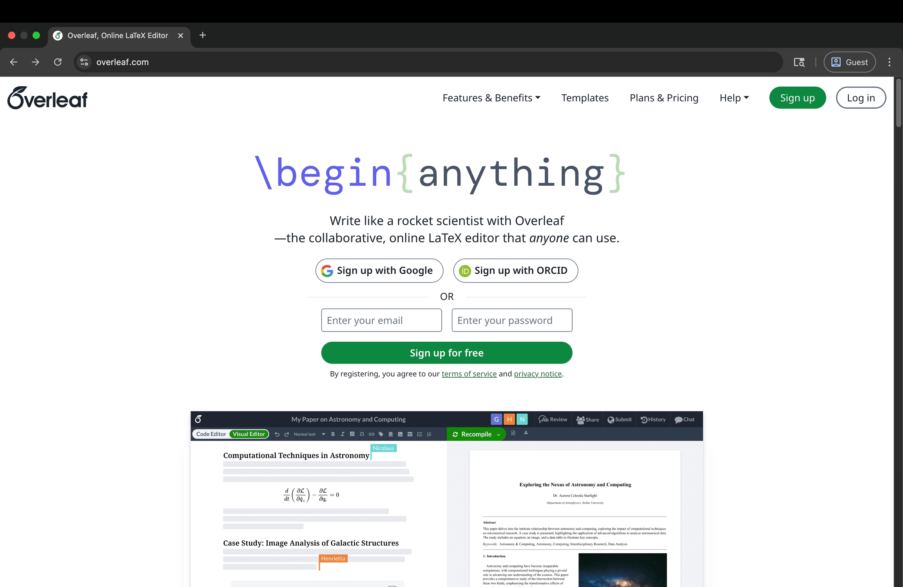
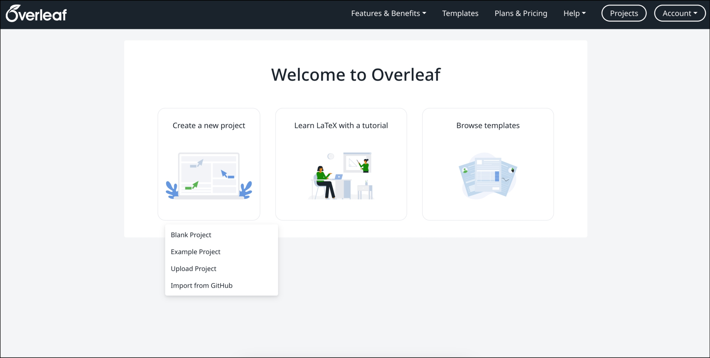

# Mở đầu cùng Overleaf

Để soạn thảo trực tiếp mà không cần phải tải và cài đặt phần mềm gì nhiều, ta có thể sử dụng trình soạn thảo trực tuyến là **Overleaf** trên bất kì trình duyệt web nào được sử dụng.

Ảnh biểu tượng (favicon) của Overleaf:

Để bắt đầu sử dụng Overleaf, hãy truy cập vào [overleaf.com](https://www.overleaf.com/) đây.

Giao diện trang web sau khi nhấp vào đường link trên:

# Đăng ký tài khoản và giao diện bắt đầu

## Đăng ký tài khoản

Để sử dụng Overleaf, ta cần đăng kí tài khoản, trong đó có hai cách để thực hiện:

1. Sử dụng tài khoản Google bạn đang có.
2. Sử dụng ORCID

Tuy vậy, người viết muốn hướng đến người dùng nên sử dụng tài khoản Google để dăng kí sử dụng **Overleaf** trong việc soạn thảo và quản lí dự án `LaTeX` trở nên nhanh chóng, lâu dài về sau này.

## Giao diện bắt đầu

Sau khi hoàn tất quá trình đăng kí, tiếp đến là hoàn tất các bước thủ tục nhập họ, tên linh tinh khác mà người mới có thể tự thực hiện. Rồi sau đó là đăng nhập vào bằng tài khoản Google mà bạn vừa mới đăng ký cho. Overleaf lúc này hiện lên sẽ có giao diện như ảnh dưới đây.

Phần đang được hiện trên hình trên gồm:

1. **Create a new project**: Đây sẽ là nơi chúng ta sẽ tạo và làm việc soạn thảo, quản lí các dự án trực tuyến trên Overleaf. (Chuyển sang bài học [Khởi tạo dự án đầu tiên](./1.2.%20Khởi%20tạo%20dự%20án%20đầu%20tiên.md) tiếp theo đây.)
2. **Learn LaTeX with tutorial**: Đây là nơi lưu trữ các bài học hướng dẫn các lệnh `LaTeX` cho người sử dụng Overleaf.
3. **Browse templates**: Đây là nơi mà người dùng Overleaf có thể tìm đến để tham khảo các mẫu tài liệu phục vụ cho nhiều mục đích sử dụng của người dùng, được thiết kế công phu, chia sẻ mã mở từ những từ những người khác.

## Tổng quan giao diện chính của Overleaf

## Tìm hiểu thêm về tài khoản Overleaf của người dùng

## Thay đổi mật khẩu người dùng

Nếu người dùng đăng nhập được vào tài khoản Overleaf, người dùng có thể thay đổi mật khẩu Overleaf của mình, bằng cách truy cập vào trang **Account settings** thông qua nhanh đường link https://www.overleaf.com/user/settings đây hoặc nếu đang ở giao diện chính của Overleaf có thể chọn . . . trong . . . có hình người ở đây

 <!--Cần bổ sung ảnh-->

Nhấp vào và chọn **Account settings**, từ giao diện chính sẽ dẫn người dùng đến trang **Account settings**

 <!--Cần bổ sung ảnh-->

Để thay đổi mật khẩu, lướt và tìm **Change password**, ở đây người dùng chỉ cần nhấp vào [Please use the password reset form to set your password](https://www.overleaf.com/user/password/reset) rồi làm theo các bước sau:

- Bước 1: Điền tài khoản Email mà bạn muốn thay đổi mật khẩu
- Bước 2: Nhấn **Send reset link** để nhận được Email hướng dẫn đặt lại mật khẩu
- Bước 3: Overleaf sẽ gửi bạn một tin nhắn . . .

## Bảo mật tài khoản người dùng

## Nguồn tham khảo cho bài soạn:
