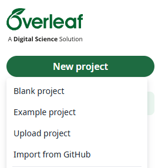
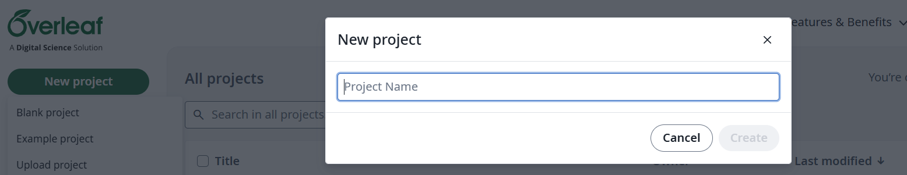
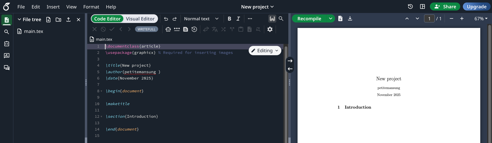
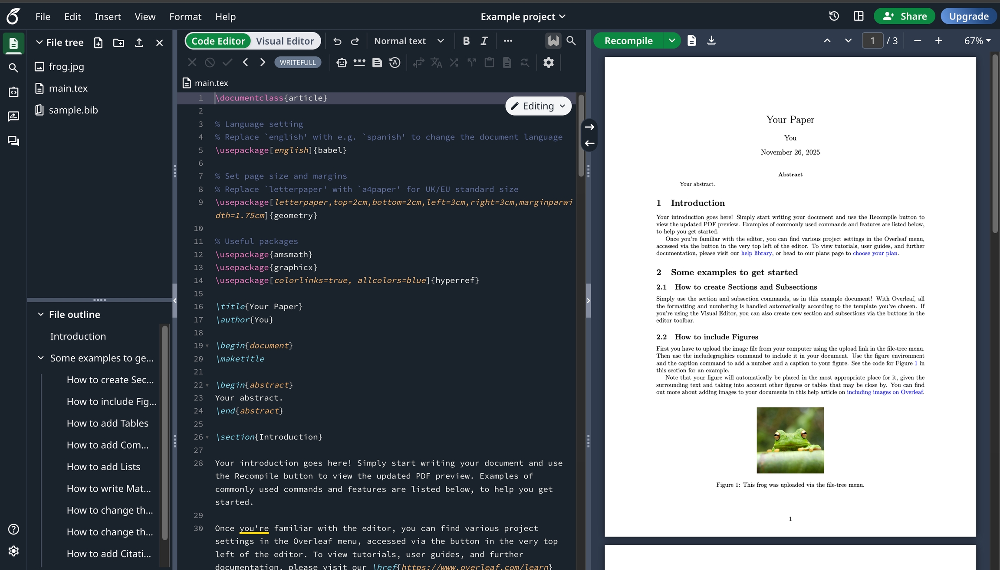

# Khởi tạo dự án đầu tiên

Sau khi đăng nhập bằng tài khoản mà người dùng vừa đăng ký để sử dụng Overleaf ở bài học [Tạo tài khoản](./1.1.%20Tạo%20tài%20khoản.md). Để bắt đầu một dự án mới, người dùng hãy nhấp vào nút **New project** ở trong thanh dọc . . ., từ đó ta sẽ thấy một menu được thả xuống mà người dùng có thể tùy ý tùy chọn như hình . . . dưới đây:

Để khởi tạo dự án đầu tiên trên Overleaf, có hai lựa chọn nhanh để bắt đầu

1. Dự án trống (Blank project)
2. Dự án ví dụ (Example project)

## Bắt đầu với một dự án trống (Blank project)

Nhấp vào **Blank project** ở . . . Một hộp thoại sẽ hiện ra, nơi người dùng có thể nhập tên cho dự án mới của mình, sau đó nhấp vào nút **Create** để chính thức tạo dự án.

Trình soạn thảo Overleaf sẽ mở ra một tài liệu được tạo chỉ với một số thông tin cơ bản được điền sẵn.

Người dùng lúc này có thể bắt đầu chỉnh sửa tệp `.tex` của mình, bằng việc soạn thảo, rồi xuất bản thành bài viết . . . Cũng như đối với người bắt đầu học LaTeX nhằm sử dụng để thực hành các mã lệnh từ các bài học [A.3. Viết và biên tập](), [A.4. Bài học nâng cao]() và [A.5. Tài liệu đặc biệt]().

## Bắt đầu với dự án ví dụ (Example project)

Nhấp vào **Example project** ở . . . Một hộp văn bản sẽ hiện ra để nhập tên cho dự án mới, cũng giống như khi ta bắt đầu với dự án trống (Blank project) trên.

Sau khi nhập tên cho dự án và nhấp vào nút **Create**, trình soạn thảo Overleaf sẽ mở ra một tài liệu mẫu có sẵn từ phía đội ngũ phát triển Ovealeaf làm ra, để người dùng có thể bắt đầu chỉnh sửa nhanh từ mẫu sẵn này thành dự án của người sử dụng hoặc lấy đó làm ví dụ trong việc phân tích, hiểu những điều căn bản từ việc sử dụng LaTeX để soạn thảo.

## Tổng quan giao diện soạn thảo của Overleaf

. . .

Trong lúc mày mò thử nghiệm với hai lựa chọn để khởi tạo dự án đầu tiên từ bài học trên. Việc để từ các đoạn mã biên dịch sang tài liệu