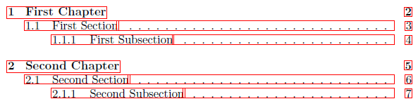
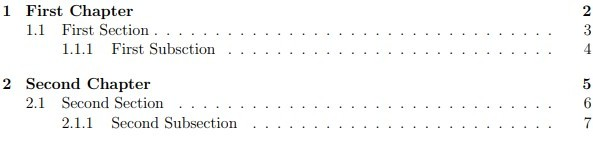
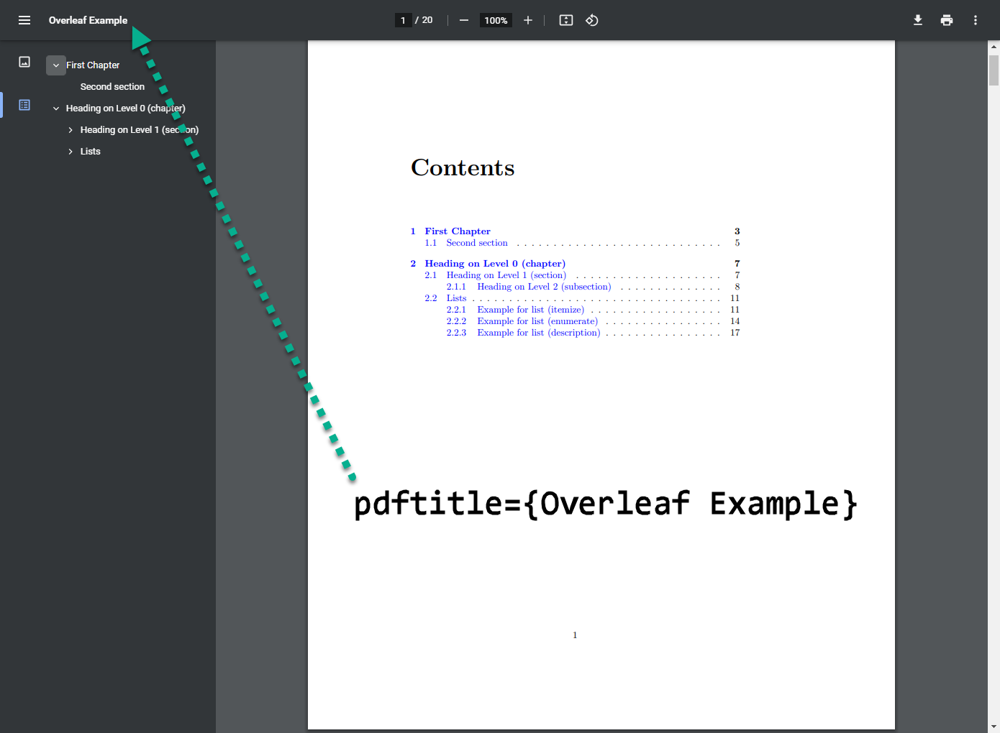

# 2. Siêu Liên kết văn bản

## 2.1. Gói `hyperref` và các tùy chỉnh

Để sử dụng siêu liên kết văn bản, người dùng cần phải thêm gói(`pack`) sau:

```latex
\usepackage[pdftex]{hyperref}
```

Gói `hyperref` đây sẽ đảm nhiệm việc chuyển các [tham chiếu]() trong tài liệu thành siêu liên kết.

Các thiết lập mặc định của LaTeX thường phù hợp với hầu hết người dùng. Cụ thể, nếu người dùng chỉ cần khai báo duy nhất gói `hyperref` trên, mà không cần các thiết lập nào nữa khác, thì LaTeX sẽ chỉ kích hoạt ứng dụng của gói đó là siêu liên kết các tham chiếu <!--Viết lại--> và hiển thị các khung màu đỏ ([mục lục]()), màu xanh dương ([liên kết thông thường](./5.1.%20Liên%20kết%20thông%20thường.md)), màu xanh lá ([tài liệu tham khảo]()) như hình ảnh minh họa sau:

<div align="center">

 <!--Sau này lên web hay LaTeX không hợp là sửa lại-->

</div>

Các khung hiện màu đỏ, xanh dương, xanh lá như vậy chỉ có trong tài liệu lúc làm việc ở trong phần soạn thảo lúc làm việc, giúp người dùng dễ dàng điều hướng. Các khung đó sẽ không còn xuất hiện trên tài liệu của người dùng khi tải về đề in.

<div align="center">

 <!--Sau này lên web hay LaTeX không hợp là sửa lại-->

</div>

Nhưng nếu người soạn tài liệu muốn thay đổi, chẳng hạn như . . . <!--Chưa viết-->, thì điều đó cũng hoàn toàn có thể.

Bằng cách sử dụng lệnh

```latex
\hypersetup{
    variable_name=new_value,
}
```

cũng được đặt ở trong . . . <!--Vị trí nào trong phần soạn thảo-->, ngay sau phần khai báo gói `hyperref` để tiện quản lý và sửa đổi.

Người soạn tài liệu có thể truyền `variable_name = new_value` vào `\hypersetup` bao nhiêu tùy thích, tùy thuộc vào kinh nghiệm của người dùng. Nên nhớ, hãy phân tách giữa các tên biến (`variable_name`) khác nhau bằng dấu phẩy, khi người dùng sử dụng chúng để thiết lập cho siêu liên kết văn bản <!--Mâu thuẫn thuật ngữ-->.

Dưới đây là bảng chỉ chứa một phần các tên biến (`variable_name`) mà người sử dụng có thể thay đổi, thường dùng quen thuộc nhất. Người dùng có thể tham khảo thêm ở [4] ở phần **Tài liệu tham khảo** <!--Sau soạn phần cơ bản này xong rồi quay lại soạn lại đầy đủ phần nâng cao này sau-->, để xem đầy đủ các tên biến (`variable_name`).

| `variable_name` | `new_value`   | Nhận xét                                                                                               |
| :-------------- | :------------ | :----------------------------------------------------------------------------------------------------- |
| bookmarks       | = true, false | Hiển thị (true) hoặc ẩn (false) cửa sổ Bookmark khi hiển thị tài liệu                                  |
| unicode         | = true, false | Có hay không cho phép sử dụng kí tự không có trong ngôn ngữ gốc Latin trong phần bookmarks của Acrobat |
| pdftoolbar      | = true,false  | Hiển thị hay không hiển thị thanh công cụ của Acrobat khi xem                                          |
| pdfmenubar      | = true,false  | Hiển thị hay không hiển thị menu của Acrobat.                                                          |
| pdffitwindow    | = true,false  | Chỉnh kích thước phóng đại ban đầu khi tập tin pdf được xem                                            |

. . .(Bảng các tên biến có thể thay đổi) <!--Chưa soạn vào đây-->

Để giúp người dùng tùy chỉnh nhanh hơn, đi cùng với đó là kết hợp với phần tham khảo bảng trên để theo dõi. Dưới đây đoạn mã lệnh các biến với giá trị mặc định của chúng. Sao chép đoạn này vào trang soạn thảo tài liệu LaTeX và thực hiện các thay đổi, tùy ý của người dùng. Bên cạnh các tên biến và giá trị của biến đó là kèm theo dòng giải thích ngắn gọn về ý nghĩa của chúng.

<!--Dịch sang tiếng Việt chưa sát nghĩa-->

```latex
\hypersetup {
    bookmarks = true,          % hiển thị thanh dấu trang?
    unicode = false,           % ký tự không phải Latinh trong dấu trang của Acrobat
    pdftoolbar = true,         % hiển thị thanh công cụ của Acrobat?
    pdfmenubar = true,         % hiển thị menu của Acrobat?
    pdffitwindow = false,      % cửa sổ vừa với trang khi mở
    pdfstartview = {FitH} ,     % vừa chiều rộng của trang với cửa sổ
    pdftitle = {My title} ,     % tiêu đề
    pdfauthor = {Author} ,      % tác giả
    pdfsubject = {Subject} ,    % chủ đề của tài liệu
    pdfcreator = {Creator} ,    % người tạo tài liệu
    pdfproducer = {Produce} , % nhà sản xuất tài liệu
    pdfkeywords = {keyword1, key2, key3} , % danh sách từ khóa
    pdfnewwindow =true,       % liên kết trong cửa sổ PDF mới
    colorlinks = false,        % false: liên kết được đóng khung; true: liên kết có màu
    linkcolor = red,           % màu của các liên kết nội bộ (thay đổi màu khung bằng linkbordercolor)
    citecolor = green,         % màu của các liên kết đến thư mục tham khảo
    filecolor = cyan,          % màu của các liên kết tệp
    urlcolor = magenta,         % màu của các liên kết bên ngoài
}
```

Kết quả:

. . .

Nếu người dùng không cần tùy chỉnh quá nhiều, sau đây lại là một ví dụ nhỏ nhưng hữu ích về việc tùy chỉnh siêu liên kết bằng các tên biến (`variable_name`) một cách đơn giản, hiệu quả cao mà người dùng có thể tham khảo.

Ví dụ: Khi xuất file PDF để in, các liên kết có màu không phải là lựa chọn tốt vì chúng sẽ bị chuyển thành màu xám trong bản in cuối cùng, gây khó đọc. Bằng việc:

Chỉ cần sử dụng lệnh khai báo gói (`pack`) cho siêu liên kết

```latex
\usepackage[pdftex]{hyperref}
```

như đã nêu ở đầu bài.

Hay

```latex
\usepackage{hyperref}
\hypersetup{colorlinks=false}
```

Kết quả:

. . .

Hoặc cũng có thể làm cho các siêu liên kết đều có màu đen:

```latex
\usepackage[hidelinks]{hyperref}
```

hay

```latex
\usepackage{hyperref}
\hypersetup{links = black,}
```

Kết quả:

. . .

## 2.2. Các tùy chọn dang riêng cho PDF

Các liên kết trong phần soạn thảo LaTeX được tạo ra, tùy chỉnh dựa trên định dạng tài liệu sẽ đọc ở định dạng PDF. Tệp PDF có thể được tùy chỉnh để bổ sung thêm thông tin và thay đổi cách trình xem PDF hiển thị.

Ví dụ: . . . <!--Viết lại phần ví dụ sao khớp với mã bên dưới hoặc viết lại toàn bộ-->

```latex
\hypersetup {
    colorlinks = true,
    linkcolor = blue,
    filecolor = magenta,
    urlcolor = cyan,
    pdftitle = {Overleaf Example}, % Tiêu đề của tập tin PDF đầu ra
    pdfpagemode = FullScreen,
}
```

Kết quả:

. . .

Tiêu đề **Overleaf Example** của tập tin PDF đầu ra hiện lên trên thanh . . . <!--Chưa viết-->

<div align="center">



</div>

## 2.3. Xem trong trình duyệt <!--Kiểm tra lại tên gọi-->

[Mình cần đọc thêm bài này thật kĩ để hiểu điều mà phần này muốn nói để viết](https://en.wikibooks.org/wiki/LaTeX/Hyperlinks#Viewing_in_a_browser)
